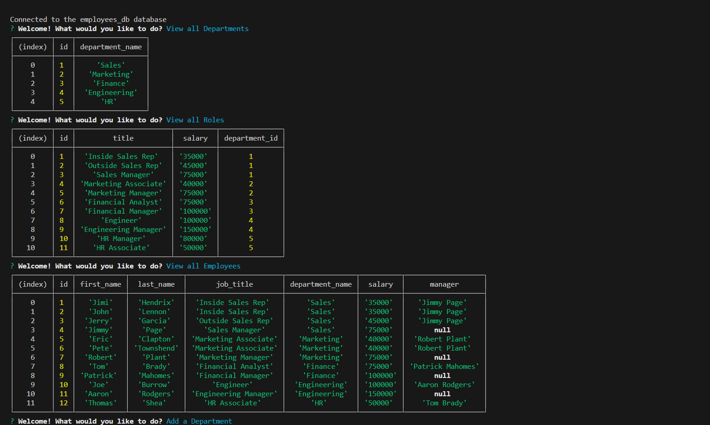

# Command Line Employee Tracker

## Description

This application that is an employee tracker that a user can operate using only the command line. The tracker allows a manager or a business owner to keep track of all employees and their roles and departments as well as adding new departments, roles, and employees. This will benefit a manager or business owner by allowing them to stay on top of staffing needs at all

## Installation

Below are the steps to install this application:
1. Navigate to my [Github Repo](https://github.com/thomasjshea/Employee-Tracker)
2. Clone the repo to your machine
3. Open the repo in VS Code or the program you prefer
4. Run the command `npm i` to install all required dependencies

## Usage

Once you have the application installed, follow the following steps for usage:
1. Create a `.env` file in the root of the repo
2. Include your MYSQL login information in the `.env` file
3. Run the command `npm start` from your command line
4. I have included a [Walkthrough Video](https://drive.google.com/file/d/1CendQfOrQ_Qm0c3Rz_LzqZc6Zo3GXSTV/view) to show the functionality of the app.

Screenshots:

## Credits

I had a tutoring session with Dru Sanchez who helped me debug, but completed the rest of this project on my own with no assistance

## License

This application uses the MIT License. 
